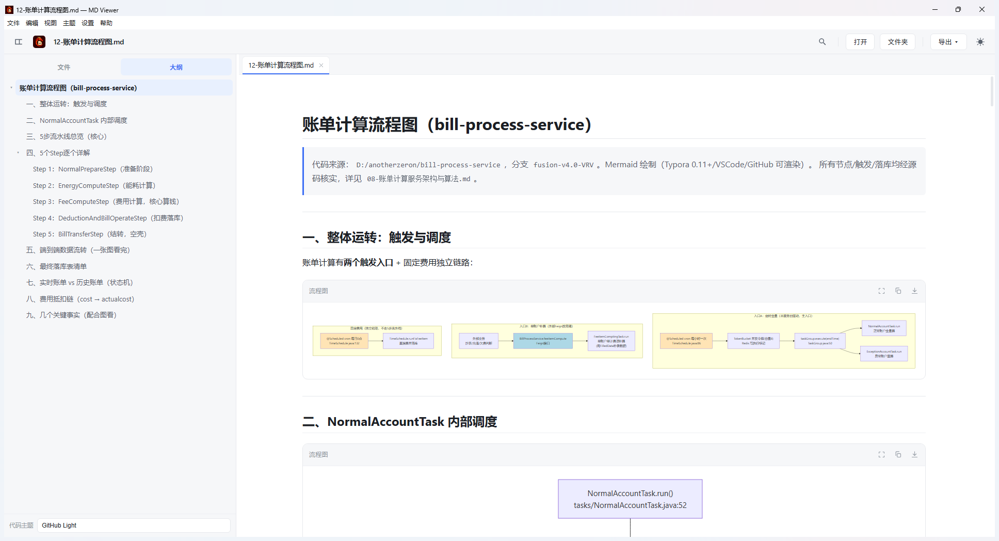

# MD Viewer

**专注本地技术文档阅读的 Windows Markdown 阅读器**

长文阅读 · 多标签工作区 · 25+ 类图表 · 中英双语界面

[下载最新版](https://github.com/zeronchen/md-viewer/releases/latest) · [English](README.en.md) · [更新记录](https://github.com/zeronchen/md-viewer/releases)

---

## MD Viewer 能做什么

MD Viewer 面向经常阅读接口文档、设计说明、代码分析和 Mermaid 图集的 Windows 用户。文件保留在本机，打开后可以在标签、目录树和大纲之间快速移动，也能把复杂图表单独放到全屏查看。

| 能力 | 具体表现 |
|---|---|
| **Markdown 阅读** | GFM、脚注、任务列表、KaTeX 数学公式、代码高亮、文档内目录与页内搜索 |
| **多标签工作区** | DOM 缓存减少重复渲染，支持会话恢复、标签切换、目录树跟随与 `Ctrl+P` 快速打开 |
| **25+ 类图表** | 20 类 Mermaid 本地渲染，另支持 PlantUML、D2、Graphviz、Vega-Lite 与 WaveDrom |
| **稳定的全屏缩放** | 全屏预览始终缩放同一张 SVG。连续缩放不会触发 Mermaid 重新布局，文字换行、节点位置和连线关系保持不变 |
| **图表交互** | 滚轮与双击缩放、拖拽平移、适应窗口、100% 显示、文字选取、ELK / dagre 布局切换与四方向切换 |
| **源码查看与转换** | 整篇 Markdown 可切换到源码模式，Mermaid 源码可在预览层编辑并用 `Ctrl+Enter` 重新生成 |
| **中英双语界面** | 支持跟随系统、中文与 English，菜单、弹窗、提示、日期和许可证状态会同步切换 |
| **阅读排版** | 阅读宽度、字号和代码主题可调，字体菜单只显示本机已经安装的常用中英文字体 |
| **导出** | 文档可导出 PDF 与单文件 HTML，图表可导出 SVG、2 倍 PNG 与 `.mmd` 源码 |
| **自动更新** | 稳定版与测试版通道可选，支持启动检查、自动下载、下载进度、失败重试与跳过指定版本 |

## 图表支持

| 类型 | 渲染位置 | 代码块语言 |
|---|---|---|
| 流程图、时序图、甘特图、类图、状态图、ER 图、饼图、思维导图、时间线、Git 图、C4、桑基图、雷达图等 | 本机 Mermaid | `mermaid` |
| PlantUML | plantuml.com | `plantuml` |
| D2 | kroki.io | `d2` |
| Graphviz / DOT | kroki.io | `dot` 或 `graphviz` |
| Vega-Lite | kroki.io | `vega-lite` |
| WaveDrom | kroki.io | `wavedrom` |

Mermaid 在本机完成渲染。其余联网图表受“联网查询”设置控制，默认会先询问；允许后只发送对应图表源码，文档其他内容不会外发。远端返回的 SVG 会经过内容消毒后再显示。

## 安装与更新

1. 打开 [Releases](https://github.com/zeronchen/md-viewer/releases/latest)
2. 下载 `MD-Viewer-Setup-1.6.1.exe`
3. 按安装向导完成安装

当前发行渠道只提供 Windows 安装版。安装后可在系统“打开方式”中使用 MD Viewer 打开 `.md`、`.markdown`、`.mdown` 与 `.mkd` 文件。

安装版会按设置检查 GitHub Releases。发现新版本后可在应用内查看版本信息、下载并重启安装。

## 隐私与安全

- Markdown、图片、代码高亮、KaTeX 与 Mermaid 默认在本机处理
- PlantUML 与 Kroki 图表只有获得联网许可后才会发送图表源码
- 更新检查会访问 GitHub Releases，下载内容仅用于软件更新
- Markdown 内容与远端 SVG 在进入界面前会经过安全处理
- 应用启用 Electron 沙箱、来源校验、导航限制与 asar 完整性保护

## 试用与许可证

- 首次使用提供 14 天全功能试用
- 许可证使用 Ed25519 离线签名并绑定机器
- 激活时进入“帮助 → 许可证”，复制机器码并导入签发的许可证文件
- 更换机器时需要凭购买信息重新签发

## 常用快捷键

| 按键 | 功能 | 按键 | 功能 |
|---|---|---|---|
| `Ctrl + O` | 打开文件 | `Ctrl + Shift + O` | 打开文件夹 |
| `Ctrl + P` | 快速打开 | `Ctrl + F` | 页内搜索 |
| `Ctrl + Tab` | 下一个标签 | `Ctrl + Shift + Tab` | 上一个标签 |
| `Ctrl + W` | 关闭标签 | `Ctrl + B` | 切换侧边栏 |
| `Ctrl + /` | 源码模式 | `Ctrl + Shift + D` | 切换明暗主题 |
| `Ctrl + Shift + P` | 导出 PDF | `Ctrl + E` | 导出 HTML |
| `Ctrl + Shift + L` | 许可证 | `Ctrl + Shift + U` | 检查更新 |

## 系统要求

- Windows 10 或 Windows 11，64 位
- 建议预留 500 MB 磁盘空间
- 无需另外安装 Node.js、Java 或浏览器运行环境
- 离线阅读可直接使用，联网图表和自动更新需要网络

---

© 2026 MD Viewer · 商业授权软件

