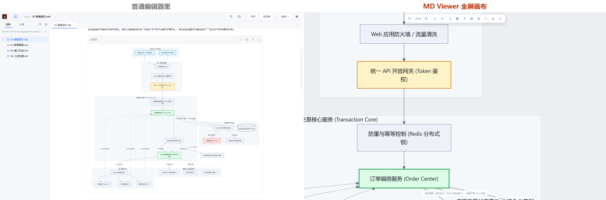
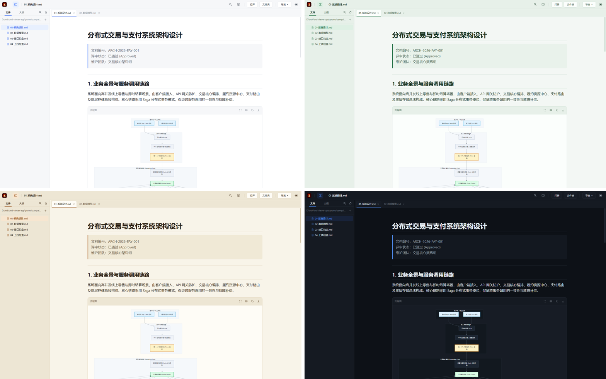
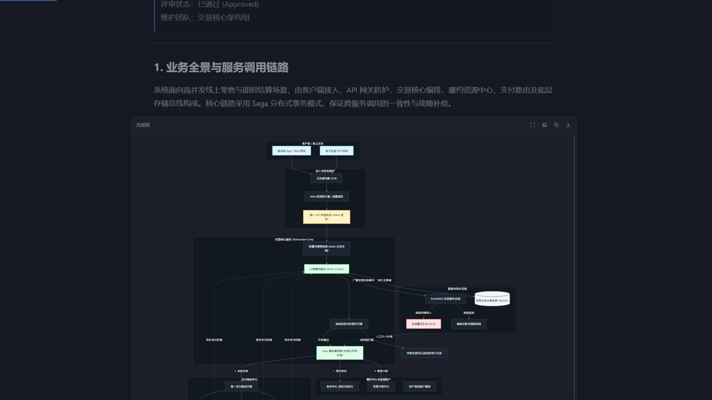

# MD Viewer

**专注本地技术文档阅读的 Windows Markdown 阅读器**

长文阅读 · 多标签工作区 · 25+ 类图表 · 四大诗意主题 · 中英双语界面

[下载最新版](https://github.com/zeronchen/md-viewer/releases/latest) · [English](README.en.md) · [更新记录](https://github.com/zeronchen/md-viewer/releases)

---

**架构图，不该缩成一团。** 几十节点的流程图、十几张表的 ER 模型，双击进全屏画布：矢量缩放、拖拽平移、一键换向，看多清楚都不失真。

**四种主题，名字都起好了。** 素雪初霁 · 森之轻语 · 琥珀暖阳 · 星夜沉幽——切换主题时，图表与代码高亮自动调色。

**按下 F11，世界安静了。** 禅阅模式收起全部干扰：版心居中、正文之外柔和变暗，读文档像读一本书。它还会记住你读到哪一行——关掉重开，回到原地。

## MD Viewer 能做什么

MD Viewer 面向经常阅读接口文档、设计说明、代码分析和 Mermaid 图集的 Windows 用户。文件保留在本机，打开后可以在标签、目录树和大纲之间快速移动，也能把复杂图表单独放到全屏查看。

| 能力 | 具体表现 |
|---|---|
| **账号授权** | 邮箱登录即解锁：一个账号最多 3 台设备，断网 14 天宽限；应用内自助管理设备、改密码、找回密码 |
| **Markdown 阅读** | GFM、脚注、任务列表、KaTeX 数学公式、代码高亮、文档内目录与页内搜索 |
| **跨文件搜索** | `Ctrl+Shift+F` 搜索当前文件夹下的全部 Markdown，按文件分组显示行号与匹配上下文，支持区分大小写、全字匹配与正则；点击结果直接跳到对应文件并高亮 |
| **多标签工作区** | DOM 缓存减少重复渲染，支持会话恢复、标签切换、目录树跟随与 `Ctrl+P` 快速打开 |
| **禅阅模式** | `F11` 进入沉浸阅读：版心自适应、专注变暗、阅读进度与大纲悬浮层 |
| **25+ 类图表** | 20 类 Mermaid 本地渲染，另支持 PlantUML、D2、Graphviz、Vega-Lite 与 WaveDrom |
| **稳定的全屏缩放** | 全屏预览始终缩放同一张 SVG。连续缩放不会触发 Mermaid 重新布局，文字换行、节点位置和连线关系保持不变 |
| **图表交互** | 滚轮与双击缩放、拖拽平移、适应窗口、100% 显示、文字选取、ELK / dagre 布局切换与四方向切换 |
| **源码查看与转换** | 整篇 Markdown 可切换到源码模式，Mermaid 源码可在预览层编辑并用 `Ctrl+Enter` 重新生成 |
| **中英双语界面** | 支持跟随系统、中文与 English，菜单、弹窗、提示、日期和许可证状态会同步切换 |
| **阅读排版** | 阅读宽度、字号和代码主题可调，字体菜单只显示本机已经安装的常用中英文字体 |
| **导出** | 文档可导出 PDF 与单文件 HTML，图表可导出 SVG、2 倍 PNG 与 `.mmd` 源码 |
| **自动更新** | 稳定版与测试版通道可选，支持启动检查、自动下载、下载进度、失败重试与跳过指定版本 |

## 授权方式（v2.0 起）

**试用**：首次使用提供 14 天全功能试用，无需注册。

**账号授权（推荐）**：购买后开通账号，凭邮箱设置密码即可。登录即授权——

- 一个账号最多绑定 **3 台设备**；第 4 台登录时会看到设备列表引导
- 应用内「我的设备」可自助解绑旧设备（密码确认，30 天内限 1 次）、修改密码
- 忘记密码通过邮箱链接找回，不会泄露账号是否存在
- **离线可用**：断网 14 天内功能不受影响；授权状态多点锚定，手改配置无法延长宽限期

**证书授权（存量兼容）**：早期版本的 `license.key` 继续有效。也可在 帮助 → 许可证 中一键**转为账号授权**（旧证书折算迁入，需联网），之后凭邮箱密码在任何设备登录。

> **首发早鸟 ¥19.9 买断**（原价 ¥69，早鸟为首发限时价）。一次购买，永久使用，不搞订阅。
> 购买请邮件 [zeronchen@qq.com](mailto:zeronchen@qq.com)，标题注明「MD Viewer 购买」——收到后当天回复并开通账号。

## 图表支持

| 类型 | 渲染位置 | 代码块语言 |
|---|---|---|
| 流程图、时序图、甘特图、类图、状态图、ER 图、饼图、思维导图、时间线、Git 图、C4、桑基图、雷达图等 | 本机 Mermaid | `mermaid` |
| PlantUML | plantuml.com | `plantuml` |
| D2 | kroki.io | `d2` |
| Graphviz / DOT | kroki.io | `dot` 或 `graphviz` |
| Vega-Lite | kroki.io | `vega-lite` |
| WaveDrom | kroki.io | `wavedrom` |

Mermaid 在本机完成渲染。其余联网图表受“联网查询”设置控制，默认会先询问；允许后只发送对应图表源码，文档其他内容不会外发。远端返回的 SVG 会经过内容消毒后再显示。

## 安装与更新

1. 打开 [Releases](https://github.com/zeronchen/md-viewer/releases/latest)
2. 下载 `MD-Viewer-Setup-3.1.4.exe`（安装版）或 `MD-Viewer-Folder-3.1.4.zip`（免安装版，解压即用）
3. 按安装向导完成安装；Release 说明附有 SHA256 校验和

安装后可在系统“打开方式”中使用 MD Viewer 打开 `.md`、`.markdown`、`.mdown` 与 `.mkd` 文件。

安装版会按设置检查 GitHub Releases。发现新版本后可在应用内查看版本信息、下载并重启安装；从任意旧版本可一次性升级到最新版。

## 隐私与安全

- Markdown、图片、代码高亮、KaTeX 与 Mermaid 默认在本机处理
- 账号授权只与授权服务器交换登录凭据、心跳与设备标识，文档内容**永不上传**
- PlantUML 与 Kroki 图表只有获得联网许可后才会发送图表源码
- 更新检查会访问 GitHub Releases，下载内容仅用于软件更新
- Markdown 内容与远端 SVG 在进入界面前会经过安全处理
- 应用启用 Electron 沙箱、来源校验、导航限制与 asar 完整性保护

## 常用快捷键

| 按键 | 功能 | 按键 | 功能 |
|---|---|---|---|
| `Ctrl + O` | 打开文件 | `Ctrl + Shift + O` | 打开文件夹 |
| `Ctrl + P` | 快速打开 | `Ctrl + F` | 页内搜索 |
| `Ctrl + Shift + F` | 跨文件搜索 | `F3` / `Shift + F3` | 下一个 / 上一个匹配 |
| `Ctrl + Tab` | 下一个标签 | `Ctrl + Shift + Tab` | 上一个标签 |
| `Ctrl + W` | 关闭标签 | `Ctrl + B` | 切换侧边栏 |
| `Ctrl + /` | 源码模式 | `Ctrl + Shift + D` | 切换主题（深浅互忆） |
| `F11` | 禅阅模式 | `Ctrl + Shift + L` | 许可证 / 账号 |
| `Ctrl + Shift + P` | 导出 PDF | `Ctrl + E` | 导出 HTML |
| `Ctrl + Shift + U` | 检查更新 | | |

> 跨文件搜索面板也可在文件树/大纲顶部继续上滚唤出；关键词为空时向下滚或按 `Esc` 收起。

## 系统要求

- Windows 10 或 Windows 11，64 位
- 建议预留 500 MB 磁盘空间
- 无需另外安装 Node.js、Java 或浏览器运行环境
- 离线阅读可直接使用（账号授权离线宽限 14 天）；联网图表和自动更新需要网络

---

© 2026 MD Viewer · 商业授权软件

